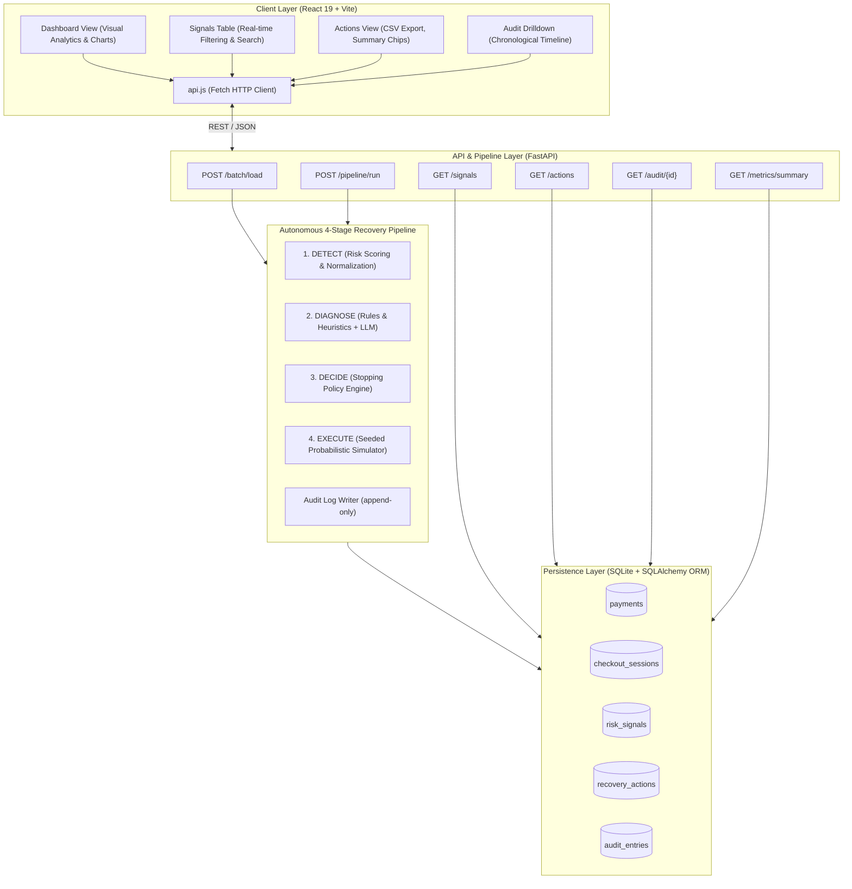
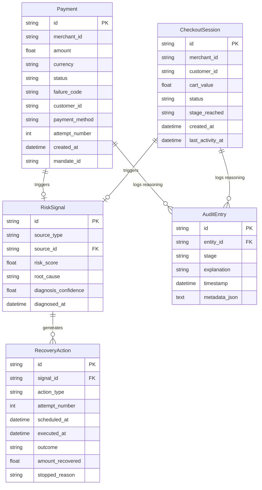
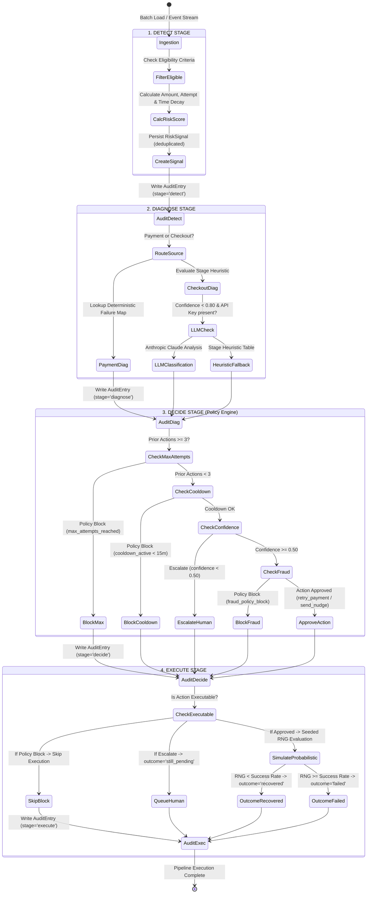
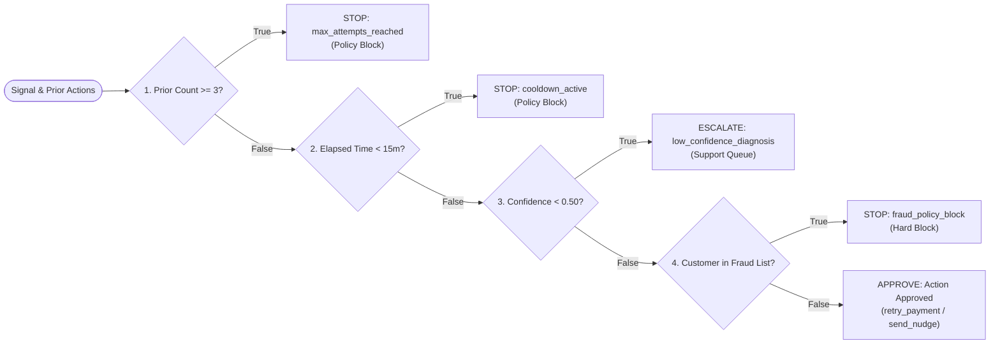

# 🏛️ BillWatch — Architecture & System Design Document

This document provides a comprehensive technical breakdown of the architecture, data models, state machines, algorithmic scoring formulas, policy engine logic, and component hierarchy of the **BillWatch AI Revenue Recovery Agent**.

---

## 1. System Overview & Architectural Topology

BillWatch operates as a decoupled client-server application optimized for low-latency batch processing, deterministic pipeline execution, and reactive user feedback.

---

## 2. Entity-Relationship & Data Model

The persistence layer is modeled in SQLAlchemy with relational foreign keys and JSON metadata serialization.

---

## 3. The 4-Stage Recovery Pipeline Specification

---

## 4. Algorithmic Formulations

### 4.1 Risk Scoring Formulation

The composite risk score $R \in [0.0, 1.0]$ prioritizes high-value transactions, repeated customer friction, and recency:

$$R = w_a \cdot \hat{A} + w_p \cdot \hat{P} + w_t \cdot T(t)$$

Where:
- **Normalized Amount ($\hat{A}$)**: $\hat{A} = \min\left(\frac{A}{A_{\max}}, 1.0\right)$ with weight $w_a = 0.40$.
- **Attempt Proximity ($\hat{P}$)**: $\hat{P} = \min\left(\frac{P}{3.0}, 1.0\right)$ for payments with weight $w_p = 0.30$. For checkout sessions, funnel stage proximity is assigned:
  $$\text{Stage Proximity} = \begin{cases} 1.00 & \text{if stage} = \text{otp} \\ 0.75 & \text{if stage} = \text{payment\_selection} \\ 0.50 & \text{if stage} = \text{address} \\ 0.25 & \text{if stage} = \text{cart} \end{cases}$$
- **Exponential Time Decay ($T(t)$)**: Models opportunity window with half-life $t_{1/2}$:
  $$T(t) = \exp\left( - \frac{\ln(2) \cdot \Delta t}{t_{1/2}} \right)$$
  - Payments: $t_{1/2} = 24.0\text{ hours}$
  - Abandoned Checkouts: $t_{1/2} = 12.0\text{ hours}$
  - Weight $w_t = 0.30$.

---

### 4.2 Deterministic Root Cause Matrix

| Source Entity | Trigger Code / Stage | Diagnosed Root Cause | Diagnostic Confidence | Default Strategy |
| :--- | :--- | :--- | :---: | :--- |
| **Payment** | `bank_timeout` | `bank_timeout` | $1.00$ | `retry_payment` (15m delay) |
| **Payment** | `otp_failed` | `otp_failed` | $1.00$ | `retry_payment` (30m delay) |
| **Payment** | `network_error` | `network_error` | $1.00$ | `retry_payment` (6m delay) |
| **Payment** | `insufficient_funds` | `insufficient_funds` | $1.00$ | `retry_payment` (6h delay) |
| **Payment** | `card_expired` | `card_expired` | $1.00$ | `send_nudge` (method update) |
| **Checkout** | `otp` | `payment_friction` | $0.90$ | `send_nudge` (SMS/WhatsApp) |
| **Checkout** | `payment_selection` | `price_hesitation` | $0.70$ | `send_nudge` (Incentive offer) |
| **Checkout** | `address` | `shipping_cost_surprise` | $0.55$ | `send_nudge` (Shipping waiver) |
| **Checkout** | `cart` | `distraction_timeout` | $0.40$ | `send_nudge` (Cart reminder) |

---

### 4.3 Probabilistic Recovery Engine

The simulated recovery outcome is determined probabilistically per root cause:

$$P(\text{Recovery} \mid \text{Cause}) = \begin{cases}
0.80 & \text{network\_error} \\
0.70 & \text{bank\_timeout} \\
0.65 & \text{otp\_failed} \\
0.55 & \text{payment\_friction} \\
0.40 & \text{insufficient\_funds} \\
0.35 & \text{price\_hesitation} \\
0.30 & \text{shipping\_cost\_surprise} \\
0.20 & \text{distraction\_timeout} \\
0.15 & \text{unknown} \\
0.05 & \text{card\_expired}
\end{cases}$$

**Deterministic Seed Formula**:
$$\text{Seed} = \text{uint32}(\text{SHA256}(\text{ActionID})[0..8])$$

This ensures that repeatedly executing a pipeline against a seeded batch produces the exact same rupee total, recovery rate, and decision breakdown.

---

## 5. Policy Engine Guardrails & Stopping Rules

The Policy Engine (`decide.py`) evaluates rules in strict cascade order. If any rule triggers, execution halts immediately with a non-recoverable status and audit entry.

---

## 6. Frontend Component Architecture

```mermaid
graph TD
    App["App.jsx (Root Layout, Header, Navigation & Global Toasts)"]
    
    App --> Tab1["Dashboard.jsx"]
    App --> Tab2["SignalTable.jsx"]
    App --> Tab3["ActionsView.jsx"]
    App --> Drill["AuditDrilldown.jsx"]

    subgraph DashboardComponents ["Dashboard Sub-Components"]
        Tab1 --> HeroStat["HeroStat & RecoveryBar (Animated Count-Up)"]
        Tab1 --> StatCards["5x Stat Cards (At Risk, Recovered, Actions, Blocked, Escalated)"]
        Tab1 --> RootCauseChart["RootCauseChart (Horizontal Multi-Bar)"]
        Tab1 --> BlockingPie["BlockingPie (SVG Conic Ring Chart)"]
    end

    subgraph SignalComponents ["Signals Sub-Components"]
        Tab2 --> SearchBar1["Search Bar (Source ID & Root Cause)"]
        Tab2 --> FilterTabs1["Filter Tabs (All / Payments / Checkouts)"]
        Tab2 --> RiskBar["Risk Score Progress Fill"]
    end

    subgraph ActionComponents ["Actions Sub-Components"]
        Tab3 --> SummaryChips["Summary Chips Row (Recovered Rupee Total)"]
        Tab3 --> OutcomeTabs["Outcome Tabs (All / Recovered / Failed / Pending)"]
        Tab3 --> CSVExporter["CSV Export Engine"]
    end

    subgraph AuditComponents ["Audit Sub-Components"]
        Drill --> Timeline["4-Stage Chronological Timeline Nodes"]
        Drill --> MetaChips["Metadata Key/Value Chips"]
    end
```

---

## 7. Security, Privacy & Integrity

1. **Simulated Action Sandbox**: No external payment APIs or SMS gateways are invoked in demo mode. All executions are sandbox simulations clearly tagged with `[SIMULATED]` in audit explanations and UI badges.
2. **Deterministic Deduplication**: Signals and actions use deterministic deterministic ID generation (`sig_{source_id}`, `act_{source_id}_{attempt}`), preventing double-charges and race conditions during concurrent runs.
3. **Audit Trail Immutability**: `AuditEntry` rows are append-only. No updates or deletions are permitted on historical audit records.
4. **Data Masking Ready**: Customer identifiers and card references conform to tokenized formats (`cust_xxx`, `card_expired`), avoiding transmission of raw PAN or PII.
