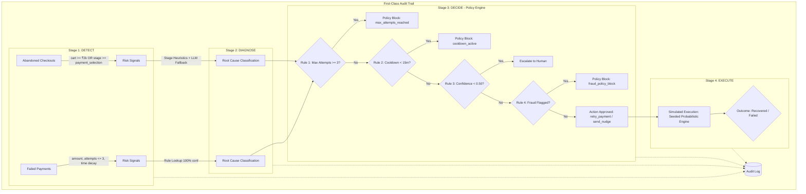

# ⚡ BillWatch : AI Revenue Recovery Agent

> **Autonomous, auditable, policy-bounded revenue recovery for modern fintech and e-commerce.**

[](./ARCHITECTURE.md)
[](./DOCUMENTATION.md)
[](./DOCUMENTATION.md#3-testing-reference)
[](#-license)

BillWatch is an intelligent revenue recovery system designed to detect failed payments and abandoned checkout sessions, diagnose the root cause with deterministic heuristics and LLM intelligence, evaluate strict stopping policies, and simulate recovery actions with full transparency and end-to-end auditability.


---

## 🌟 Key Highlights

- **4-Stage Pipeline**: Modular execution through `DETECT` ➔ `DIAGNOSE` ➔ `DECIDE` ➔ `EXECUTE`.
- **Policy Engine with Explicit Stopping Rules**: Strict guardrails preventing infinite loops, customer harassment, and fraudulent retries.
- **First-Class Auditability**: Every recovered rupee or blocked attempt has an inspectable 4-stage audit trail with explanations and metadata.
- **Dark Fintech Dashboard**: Modern glassmorphism interface with real-time stats, animated metric count-ups, SVG charts, search & filter controls, and CSV export.
- **100% Deterministic & Reproducible**: Seeded synthetic dataset and deterministic recovery simulation for audit verification.
- **Enterprise-Grade Test Suite**: **224 automated tests** (146 backend pytest + 77 frontend Vitest + E2E verification test) with 100% pass rate.

---

## 🏗️ Architecture & Pipeline Flow



---

## ⚙️ The 4 Pipeline Stages

### 1. 🔍 Detect
Scans payments and checkout sessions to generate normalized `RiskSignal` records:
- **Payments**: Flags transactions where `status == 'failed'`, `attempt_number <= 3`, and no prior successful recovery exists. Risk score combines normalized amount (40%), attempt proximity (30%), and exponential time decay (30%, 24h half-life).
- **Checkouts**: Flags abandoned sessions where `stage_reached >= 'payment_selection'` OR `cart_value >= ₹2,000` (12h half-life).

### 2. 🔬 Diagnose
Classifies the underlying root cause:
- **Payments (Deterministic)**: Maps payment failure codes to standard causes:
  - `bank_timeout` ➔ retry soon (15m delay)
  - `otp_failed` ➔ retry soon (30m delay)
  - `network_error` ➔ retry soon (6m delay)
  - `insufficient_funds` ➔ retry after hours (6h delay)
  - `card_expired` ➔ request new payment method (nudge)
- **Checkouts (Heuristic + LLM)**: Analyzes checkout funnel stage (`otp` ➔ `payment_friction` [0.90], `payment_selection` ➔ `price_hesitation` [0.70], `address` ➔ `shipping_cost_surprise` [0.55], `cart` ➔ `distraction_timeout` [0.40]), with optional Anthropic Claude LLM classification for ambiguous cases.

### 3. ⚖️ Decide (Policy Engine)
Enforces 4 strict stopping rules in priority order:
1. **Max Attempts**: If $\ge 3$ prior actions have been attempted $\rightarrow$ `no_action_policy_block` (`max_attempts_reached`).
2. **Cooldown Active**: If the previous attempt was $< 15$ minutes ago $\rightarrow$ `no_action_policy_block` (`cooldown_active`).
3. **Low Confidence**: If diagnosis confidence $< 0.50 \rightarrow$ routes to human review (`escalate_human`, `still_pending`).
4. **Fraud Policy**: If the customer ID is flagged $\rightarrow$ hard block (`fraud_policy_block`).
5. **Approved**: Maps root cause to bounded action type (`retry_payment` or `send_nudge`).

### 4. ⚡ Execute (Simulated)
Simulates recovery outcome using root-cause-specific success rates:
- Seeded pseudo-random engine keyed on entity and action IDs guarantees deterministic reproducibility.
- Recovered amounts, failed statuses, and simulated notifications are persisted to the database and audit trail.

---

## 🖥️ UI Components & Features

The frontend is built with **React 19 + Vite** featuring a dark fintech theme with glassmorphic cards and glowing status indicators:

* **📊 Dashboard (`Dashboard.jsx`)**:
  * Hero stat with animated count-up numbers and visual recovery progress bar.
  * Real-time stat cards: At Risk, Recovered, Actions Taken, Blocked by Policy, Escalated to Human.
  * Horizontal bar chart displaying recovery vs. attempt breakdown per root cause.
  * SVG donut chart visualizing stopping rule distribution.
* **🔍 Signals View (`SignalTable.jsx`)**:
  * Real-time search bar filtering by Source ID and Root Cause.
  * Filter tabs: All Signals, Payments, Checkouts.
  * Proportional color-coded risk score progress bars.
  * Sortable columns and one-click navigation to full audit trail.
* **⚡ Actions View (`ActionsView.jsx`)**:
  * Summary metrics row with live recovered rupee totals.
  * Outcome filters (All, Recovered, Failed, Pending).
  * Filterable search and sortable table columns.
  * **📥 CSV Export**: One-click download of filtered recovery action data.
* **📜 Audit Trail Drilldown (`AuditDrilldown.jsx`)**:
  * Visual 4-stage chronological timeline (`Detect` ➔ `Diagnose` ➔ `Decide` ➔ `Execute`).
  * Detailed policy explanation and key/value metadata chips.

---

## 📁 Repository Structure

```
billwatch/
├── backend/
│   ├── app/
│   │   ├── models.py             # SQLAlchemy ORM models (Payment, Signal, Action, Audit)
│   │   ├── database.py           # SQLite connection, sessionmaker & schema setup
│   │   ├── schemas.py            # Pydantic validation schemas
│   │   ├── metrics.py            # Financial metric aggregations
│   │   ├── main.py               # FastAPI entry point & CORS configuration
│   │   ├── pipeline/
│   │   │   ├── detect.py         # Stage 1: Signal detection & risk scoring
│   │   │   ├── diagnose.py       # Stage 2: Root-cause diagnosis & LLM fallback
│   │   │   ├── decide.py         # Stage 3: Policy engine & stopping rules
│   │   │   ├── execute.py        # Stage 4: Simulated recovery action execution
│   │   │   └── audit.py          # Audit log persistence helper
│   │   └── routes/
│   │       ├── batch.py          # POST /batch/load
│   │       ├── pipeline.py       # POST /pipeline/run
│   │       ├── signals.py        # GET /signals
│   │       ├── actions.py        # GET /actions
│   │       ├── audit.py          # GET /audit/{id}
│   │       └── metrics.py        # GET /metrics/summary
│   ├── tests/                    # 146 Pytest Unit & Integration Tests
│   │   ├── conftest.py           # In-memory SQLite fixtures & mock overrides
│   │   ├── test_detect.py        # Detection stage unit tests
│   │   ├── test_diagnose.py      # Diagnosis stage unit tests
│   │   ├── test_decide.py        # Policy engine stopping rule tests
│   │   ├── test_execute.py       # Execution simulation tests
│   │   ├── test_api.py           # HTTP endpoint integration tests
│   │   └── test_generate_data.py # Data generator constraint tests
│   ├── generate_data.py          # Seeded synthetic dataset generator (SEED=42)
│   ├── test_e2e.py               # Standalone end-to-end verification script
│   └── requirements.txt
│
└── frontend/
    ├── src/
    │   ├── components/
    │   │   ├── Dashboard.jsx       # Financial overview, charts, animated metrics
    │   │   ├── SignalTable.jsx     # Flagged signals table with search & sort
    │   │   ├── ActionsView.jsx     # Recovery actions list, CSV export, summary chips
    │   │   └── AuditDrilldown.jsx  # 4-stage chronological timeline
    │   ├── test/                   # 77 Vitest Component & API Tests
    │   │   ├── setup.js            # Vitest DOM environment setup
    │   │   ├── mocks.js            # Shared test mock data
    │   │   ├── Dashboard.test.jsx
    │   │   ├── SignalTable.test.jsx
    │   │   ├── ActionsView.test.jsx
    │   │   ├── AuditDrilldown.test.jsx
    │   │   ├── App.test.jsx
    │   │   └── api.test.js
    │   ├── App.jsx                 # Root layout, navigation tabs, live clock & toasts
    │   ├── api.js                  # Frontend HTTP client
    │   └── index.css               # Vanilla CSS design system & tokens
    ├── package.json
    └── vite.config.js              # Vite & Vitest configuration
```

---

## 🚀 Quick Start Guide

### Prerequisites
- **Python 3.10+**
- **Node.js 18+** & **npm**

### 1. Backend Setup
```powershell
cd backend
pip install -r requirements.txt
pip install pytest httpx pytest-asyncio
```

Run the backend development server:
```powershell
python -m uvicorn app.main:app --reload --port 8000
```
Backend API will be live at `http://localhost:8000` (Swagger docs at `http://localhost:8000/docs`).

### 2. Frontend Setup
```powershell
cd frontend
npm install
```

Run the frontend development server:
```powershell
npm run dev
```
Frontend UI will be live at `http://localhost:5173`.

---

## 🧪 Running the Tests

BillWatch includes a comprehensive 224-test suite covering all unit, pipeline, heuristic, stopping rule, API, and UI behavior.

### Run Backend Unit & Integration Tests (146 tests)
```powershell
cd backend
python -m pytest tests/ -v
```

### Run Frontend Component & API Tests (77 tests)
```powershell
cd frontend
npm test
```

### Run Full End-to-End Verification
```powershell
cd backend
python test_e2e.py
```

---

## 🔌 API Endpoints Reference

| Method | Endpoint | Description |
| :--- | :--- | :--- |
| `POST` | `/batch/load` | Resets DB and loads 60 payments & 40 checkout sessions. |
| `POST` | `/pipeline/run` | Executes the 4-stage recovery pipeline over all active records. |
| `GET` | `/signals` | Returns flagged signals (optional query: `?source_type=payment\|checkout`). |
| `GET` | `/actions` | Returns all recovery actions (optional query: `?outcome=recovered\|failed`). |
| `GET` | `/audit/{entity_id}` | Retrieves the complete 4-stage audit trail for a payment or session. |
| `GET` | `/metrics/summary` | Returns aggregated recovery totals, recovery rate, and breakdown charts. |

---

## ⚠️ Simulation Notice
*All recovery actions (card retries, SMS alerts, nudges) in this system are strictly **simulated** using seeded probabilistic heuristics. No real financial charges or customer communications are triggered.*

---

## 📄 License
MIT License. Built for demo and production revenue recovery evaluation.
